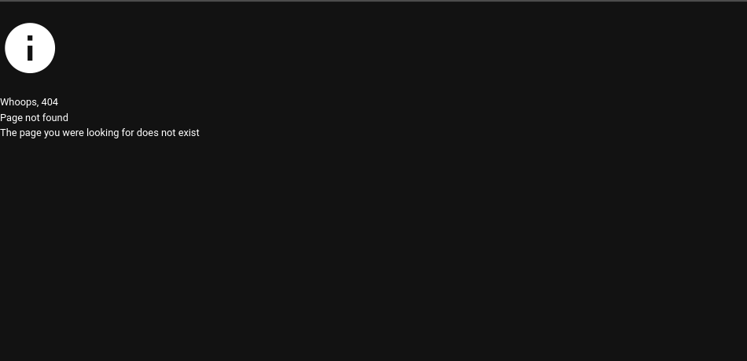

# Minimal example to include a Vuetify client in an application

I'm definitely facing an issue to include correctly a Vuetify client into a main Vuetify application. Client components such as [empty states](https://vuetifyjs.com/en/components/empty-states/) render wrong. The following shows the first example in my context. The image is not downloaded and the typo is wrong.



To try to re-produce my production bug, I made a minimal example from automatically generated starter codes.

I'd like to have pieces of advice as the client renders well on its own. Once builded and included in the application, this is rendered wrong. I suppose it to be:

- a build configuration issue?
- an import issue?
-

I'll discuss these options in a second with right file paths.

## Summary

`library` is the client to be generated, `app` is the main application.

Both are written in TS and use Vuetify as a component library and Vite as a build tool.

## Development installation

The commands to install a dev version are:

```
npm --prefix library install
npm --prefix library run build:lib
npm --prefix library link
npm --prefix app install
npm --prefix app link library
npm --prefix app run dev
```

## The build configuration

The main script which exports my main client template is [library/src/index.ts](library/src/index.ts) (its built version is used in the package.json as main entrypoint).

The corresponding Vite build configuration is the [library/vite.lib.config.mts](library/vite.lib.config.mts) file. I removed externalized packages as, for the moment, reducing the build size is not a priority for me.

The built package is located in `library/dist` and is pointed out by [library/package.json](library/package.json).

## The import process

The desired client component is imported from the library dependency and used in the main application in [app/src/App.vue](app/src/App.vue). This could be configured via the plugin configuration, of course.


## Any idea ?

Please send me a response on discord.